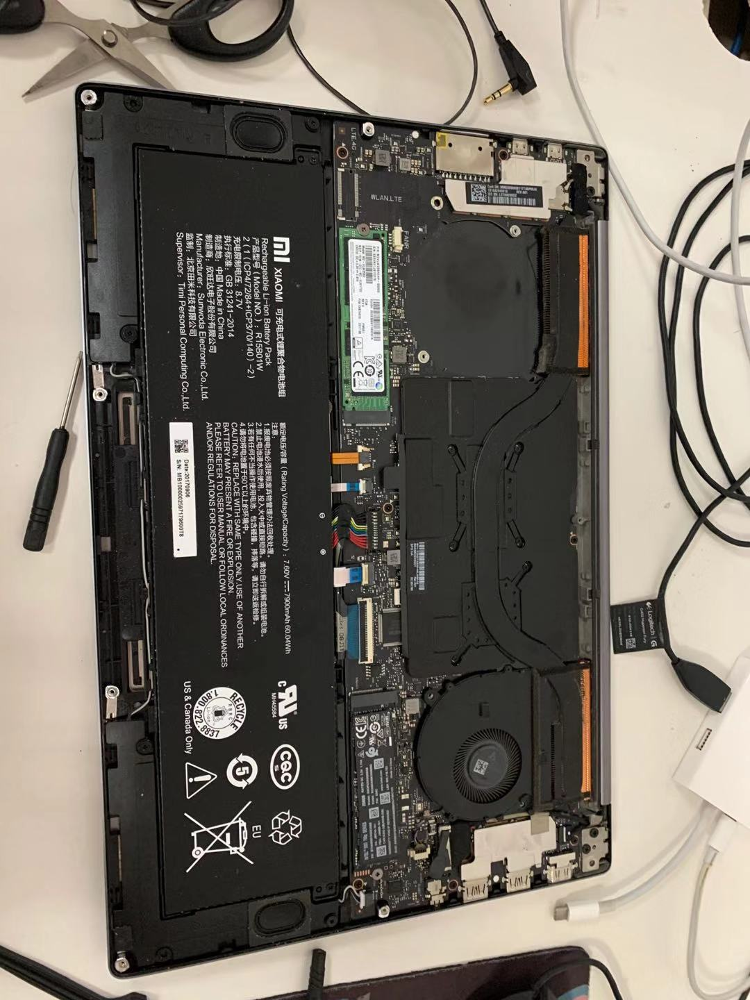
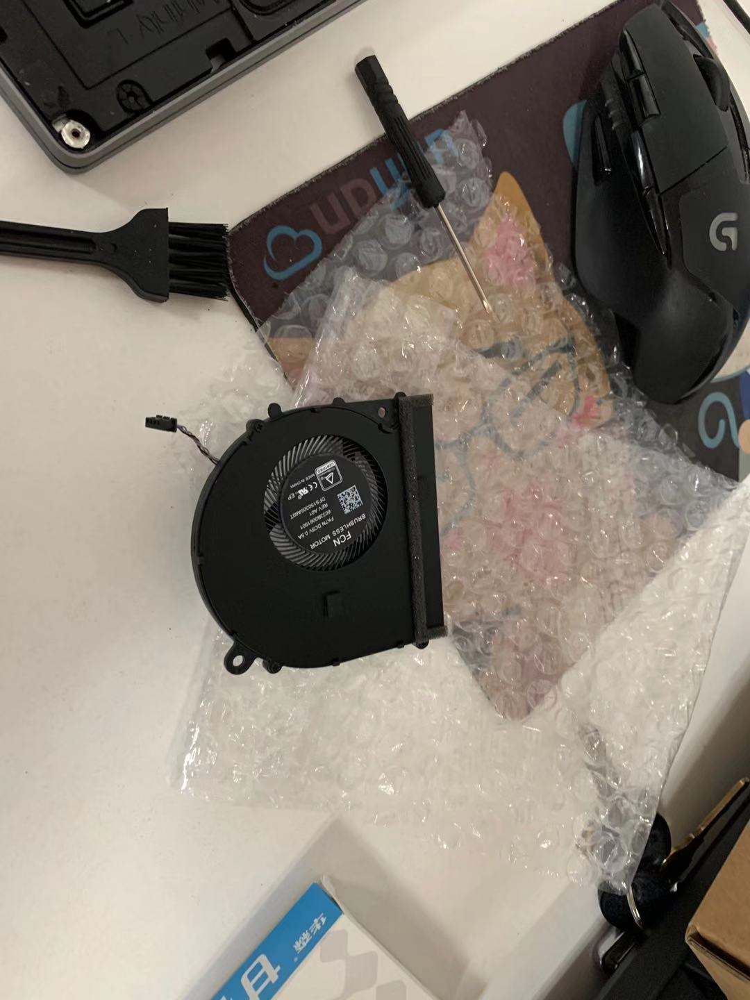
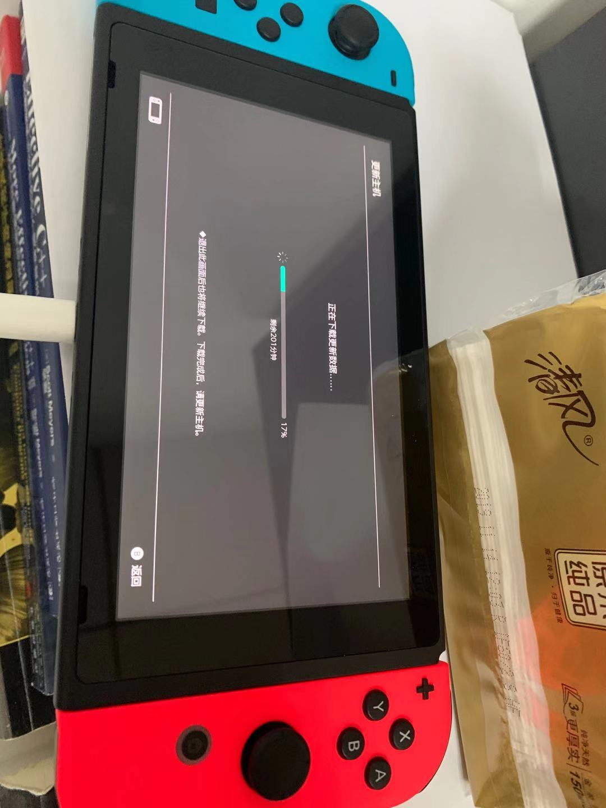

今天又赖床到10点了，emmm。

起来看一会视频，吃个饭去拿风扇和我等了七天的switch，开心😊。

风扇这东西，好像是我这台电脑的通病，总是在闭合情况下打开电脑时，风扇总会发出间断性的噪声，本来以为我是以为是风扇能够检测外侧震动，从而保护自己的一种措施，没想这玩意失控，噪声相当难忍受。

拆机图:

风扇：

switch到了，等待更新中：

这是我是PDD，2279(港版主机加塞尔达)，真的太香了。可惜只有单独主机，转接头、闪存、保护包还要另外买。

其他东西还在路上，不知道还要不要买个pro手柄。

今天就先这样了吧。