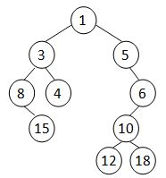

### 感想
第一次拿100，留个纪念。

这是第二次考了， 第一次9月份考的，准备作为考研机试。考前准备复习了十几个小时就上考场了

第一考的时候心态不太好，看到第一题，心态崩了，搞了好久一个半小时一分没拿，后来心态回了点，把后面三题写完了， 最后没时间写第一题了。

第二次考的时候，心态稍微好了一点，看到第一题，没看懂，心态有点微崩。 直接做后面三题，还是比较简单的。回过来做第一个，其实也就是个格式控制，半小时写完出考场了。

本来以为会考AVL和最短路径或者集合的，结果没考，紧张死了。

### 7-1 Good in C (20分)

When your interviewer asks you to write "Hello World" using C, can you do as the following figure shows?


#### Input Specification:
Each input file contains one test case. For each case, the first part gives the 26 capital English letters A-Z, each in a 7×5 matrix of C's and .'s. Then a sentence is given in a line, ended by a return. The sentence is formed by several words (no more than 10 continuous capital English letters each), and the words are separated by any characters other than capital English letters.

It is guaranteed that there is at least one word given.

#### Output Specification:
For each word, print the matrix form of each of its letters in a line, and the letters must be separated by exactly one column of space. There must be no extra space at the beginning or the end of the word.

Between two adjacent words, there must be a single empty line to separate them. There must be no extra line at the beginning or the end of the output.

#### Sample Input:
<!-- more -->
```
..C..
.C.C.
C...C
CCCCC
C...C
C...C
C...C
CCCC.
C...C
C...C
CCCC.
C...C
C...C
CCCC.
.CCC.
C...C
C....
C....
C....
C...C
.CCC.
CCCC.
C...C
C...C
C...C
C...C
C...C
CCCC.
CCCCC
C....
C....
CCCC.
C....
C....
CCCCC
CCCCC
C....
C....
CCCC.
C....
C....
C....
CCCC.
C...C
C....
C.CCC
C...C
C...C
CCCC.
C...C
C...C
C...C
CCCCC
C...C
C...C
C...C
CCCCC
..C..
..C..
..C..
..C..
..C..
CCCCC
CCCCC
....C
....C
....C
....C
C...C
.CCC.
C...C
C..C.
C.C..
CC...
C.C..
C..C.
C...C
C....
C....
C....
C....
C....
C....
CCCCC
C...C
C...C
CC.CC
C.C.C
C...C
C...C
C...C
C...C
C...C
CC..C
C.C.C
C..CC
C...C
C...C
.CCC.
C...C
C...C
C...C
C...C
C...C
.CCC.
CCCC.
C...C
C...C
CCCC.
C....
C....
C....
.CCC.
C...C
C...C
C...C
C.C.C
C..CC
.CCC.
CCCC.
C...C
CCCC.
CC...
C.C..
C..C.
C...C
.CCC.
C...C
C....
.CCC.
....C
C...C
.CCC.
CCCCC
..C..
..C..
..C..
..C..
..C..
..C..
C...C
C...C
C...C
C...C
C...C
C...C
.CCC.
C...C
C...C
C...C
C...C
C...C
.C.C.
..C..
C...C
C...C
C...C
C.C.C
CC.CC
C...C
C...C
C...C
C...C
.C.C.
..C..
.C.C.
C...C
C...C
C...C
C...C
.C.C.
..C..
..C..
..C..
..C..
CCCCC
....C
...C.
..C..
.C...
C....
CCCCC
HELLO~WORLD!
```

```
C...C CCCCC C.... C.... .CCC.
C...C C.... C.... C.... C...C
C...C C.... C.... C.... C...C
CCCCC CCCC. C.... C.... C...C
C...C C.... C.... C.... C...C
C...C C.... C.... C.... C...C
C...C CCCCC CCCCC CCCCC .CCC.

C...C .CCC. CCCC. C.... CCCC.
C...C C...C C...C C.... C...C
C...C C...C CCCC. C.... C...C
C.C.C C...C CC... C.... C...C
CC.CC C...C C.C.. C.... C...C
C...C C...C C..C. C.... C...C
C...C .CCC. C...C CCCCC CCCC.
```


#### 解析
这题，它给了26个单词的7×5矩阵的字符表示形式，要求把把最后的字符串的大写单词分别表出来。  

这题坑点就是严格的格式。首先很自然的会用一个数组储存单词的表示形式，所以我用了一个`data[26][7][5]`数组存，注意不要将结尾的回车存入。使用`getline`获得一整行字符串，然后将字符串遍历，将小于10个字符长度的全大写连续的单词存起来，用作结果输出。然后按行输出，可以看出每一个单词都是七行，然后根据每个单词，输出对应行，就可以了，格式注意一下就好了。

#### Solution：
```c++
#include <iostream>
#include <vector>
#include <string>
using namespace std;

int main() {
	char data[26][7][5], ch;
	for(int i = 0; i < 26; ++i) { //存数据
		for(int j = 0; j < 7; ++j) {
			for(int k = 0; k < 5; ++k) {
				scanf("%c", &ch);
				if(ch == '\n') k--; //跳过回车
				else data[i][j][k] = ch;	
			}
		}
	}
	getchar(); // 字符串处理
	string s, s1 = "";
	getline(cin, s);
	vector<string> result;
	for(int i = 0; i < s.size(); ++i) {
		if('A' <= s[i] && s[i] <= 'Z') {
			s1 += s[i];
		} else {
			if(s1 != "" && s1.length() <= 10)
				result.push_back(s1);
			s1 = "";
		}
	}
	if(s1 != "") result.push_back(s1);
	for(int i = 0; i < result.size(); ++i) { // 输出模块
		for(int j = 0; j < 7; ++j) {
			for(int k = 0; k < result[i].size(); ++k) {
				for(int l = 0; l < 5; ++l) {
					printf("%c", data[result[i][k]- 'A'][j][l]);
				}
				if(k != result[i].size() - 1) printf(" ");
			}
			printf("\n");
		}
		if(i != result.size() - 1) printf("\n");
	}
	
	
}
```


### 7-2 Block Reversing (25分)

Given a singly linked list L. Let us consider every K nodes as a `block` (if there are less than K nodes at the end of the list, the rest of the nodes are still considered as a block). Your job is to reverse all the blocks in L. For example, given L as 1→2→3→4→5→6→7→8 and K as 3, your output must be 7→8→4→5→6→1→2→3.

#### Input Specification:
Each input file contains one test case. For each case, the first line contains the address of the first node, a positive N (≤$10^5$) which is the total number of nodes, and a positive K (≤N) which is the size of a block. The address of a node is a 5-digit nonnegative integer, and NULL is represented by −1.

Then N lines follow, each describes a node in the format:

>Address Data Next
   
where Address is the position of the node, Data is an integer, and Next is the position of the next node.

#### Output Specification:
For each case, output the resulting ordered linked list. Each node occupies a line, and is printed in the same format as in the input.

#### Sample Input:
```
00100 8 3
71120 7 88666
00000 4 99999
00100 1 12309
68237 6 71120
33218 3 00000
99999 5 68237
88666 8 -1
12309 2 33218
```
      
    
#### Sample Output:
```
71120 7 88666
88666 8 00000
00000 4 99999
99999 5 68237
68237 6 00100
00100 1 12309
12309 2 33218
33218 3 -1
```

#### 解析

常规的链表题，就是将每K个数据编成一组，然后将这几个组逆置。为了稳妥起见，使用结构体数组存链式关系，然后从开头遍历，每k个存入同一个`vecotr<node>`，再将这个`vector<node>`存入`vector<vector<node>>`，然后拼接成一个`vector<node>`，然后遍历重新改写next就好了，最后在注意一下格式就行了。

#### Solution:
```c++
#include <iostream>
#include <vector>
#include <algorithm>
using namespace std;

struct node {
	int address;
	int key;
	int next;
};

node list[100100];

int main() {
	int start, n, k;
	cin >> start >> n >> k;
	
	int s, key, ne;
	for(int i = 0; i < n; ++i) {
		scanf("%d", &s);
		scanf("%d %d", &list[s].key, &list[s].next);
		list[s].address = s;
	}
	vector<vector<node>> data;
	
	while(start != -1) {
		int count = k;
		vector<node> tmp;
		while(count-- && start != -1) {
			tmp.push_back(list[start]);
			start = list[start].next;
		}
		data.push_back(tmp);
	}
	
	
	vector<node> result;
	
	for(int i = data.size() - 1; i >= 0; --i) {
		result.insert(result.end(), data[i].begin(), data[i].end());
	}
	
	for(int i = 0; i < result.size(); ++i) {
		if(i == result.size() - 1) result[i].next = -1;
		else result[i].next = result[i+1].address;
	}
	for(int i = 0; i < result.size(); ++i) {
		if(i == result.size() - 1) {
			printf("%05d %d -1\n", result[i].address, result[i].key);
		}
		else {
			printf("%05d %d %05d\n", result[i].address, result[i].key, result[i].next);
		}
	}
}
```


### 7-3 Summit (25分)
A summit (峰会) is a meeting of heads of state or government. Arranging the rest areas for the summit is not a simple job. The ideal arrangement of one area is to invite those heads so that everyone is a direct friend of everyone.

Now given a set of tentative arrangements, your job is to tell the organizers whether or not each area is all set.

#### Input Specification:
Each input file contains one test case. For each case, the first line gives two positive integers N (≤ 200), the number of heads in the summit, and M, the number of friendship relations. Then M lines follow, each gives a pair of indices of the heads who are friends to each other. The heads are indexed from 1 to N.

Then there is another positive integer K (≤ 100), and K lines of tentative arrangement of rest areas follow, each first gives a positive number L (≤ N), then followed by a sequence of L distinct indices of the heads. All the numbers in a line are separated by a space.

#### Output Specification:
For each of the K areas, print in a line your advice in the following format:

if in this area everyone is a direct friend of everyone, and no friend is missing (that is, no one else is a direct friend of everyone in this area), print Area X is OK..

if in this area everyone is a direct friend of everyone, yet there are some other heads who may also be invited without breaking the ideal arrangement, print Area X may invite more people, such as H. where H is the smallest index of the head who may be invited.

if in this area the arrangement is not an ideal one, then print Area X needs help. so the host can provide some special service to help the heads get to know each other.

Here X is the index of an area, starting from 1 to K.

#### 解析

[pat1142](https://pintia.cn/problem-sets/994805342720868352/problems/994805343979159552)原题考过，不难，就是判断给出的这几个人是否互为朋友，如果为朋友，是否存在一个人不在其中，缺与其他人都是朋友关系。这题可以设置两个判断。第一个判断，判断人是否相互为朋友，暴力搜两个人之间是否有关系。第二个判断，判断是否有这样的一个人，暴力搜不在其中的人的人际关系。

#### Sample Input:
```
8 10
5 6
7 8
6 4
3 6
4 5
2 3
8 2
2 7
5 3
3 4
6
4 5 4 3 6
3 2 8 7
2 2 3
1 1
2 4 6
3 3 2 1
```
      
    
#### Sample Output:
```
Area 1 is OK.
Area 2 is OK.
Area 3 is OK.
Area 4 is OK.
Area 5 may invite more people, such as 3.
Area 6 needs help.
```

#### Solution:
```c++
#include <iostream>
#include <vector>
#include <algorithm>
using namespace std;

int e[210][210];
bool vis[210];
int person = 0;
int n, m, a, b;

bool judge1(vector<int> &data) {
	for(int i = 0; i < data.size(); ++i) {
		for(int j = i + 1; j < data.size(); ++j) {
			if(!e[data[i]][data[j]]) return false;
		}
	}
	return true;
}

bool judge2(vector<int> &data) {
	for(int i = 1; i <= n; ++i) {
		if(!vis[i]) {
			int j = 0;
			for(; j < data.size(); ++j) {
				if(!e[i][data[j]]) break;
			}
			if(j == data.size()) {
				person = i;
				return false;
			}
		}
	}
	
	return true;
}

int main() {
	
	cin >> n >> m;
	for(int i = 0; i < m; ++i) {
		scanf("%d %d", &a, &b);
		e[a][b] = 1;
		e[b][a] = 1;
	}
	
	int k;
	cin >> k;
	for(int j = 1; j <= k; ++j) {
		int l;
		cin >> l;
		vector<int> data;
		fill(vis, vis + 210, false);
		for(int i = 0; i < l; ++i) {
			scanf("%d", &a);
			data.push_back(a);
			vis[a] = true;
		}
		if(!judge1(data)) {
			printf("Area %d needs help.\n", j);
		} else if(judge2(data)){
			printf("Area %d is OK.\n", j);
		} else {
			printf("Area %d may invite more people, such as %d.\n", j, person);
		}
	}
	
}
```


### 7-4 Cartesian Tree (30分)

A Cartesian tree is a binary tree constructed from a sequence of distinct numbers. The tree is heap-ordered, and an inorder traversal returns the original sequence. For example, given the sequence { 8, 15, 3, 4, 1, 5, 12, 10, 18, 6 }, the min-heap Cartesian tree is shown by the figure.



Your job is to output the level-order traversal sequence of the min-heap Cartesian tree.

#### Input Specification:
Each input file contains one test case. Each case starts from giving a positive integer N (≤30), and then N distinct numbers in the next line, separated by a space. All the numbers are in the range of int.

#### Output Specification:
For each test case, print in a line the level-order traversal sequence of the min-heap Cartesian tree. All the numbers in a line must be separated by exactly one space, and there must be no extra space at the beginning or the end of the line.

#### Sample Input:
```
10
8 15 3 4 1 5 12 10 18 6
```
      
    
#### Sample Output:
```
1 3 5 8 4 6 15 10 12 18
```


#### 解析

这题是利用堆的一个中序，生成堆，并且输出它的层序遍历结果。
这题也不难，其实和前序中序生成树或者中序后序生成树差不多。为了防止爆数组，我是用map充当数组的作用，递归建树。

#### Solution

```c++
#include <iostream>
#include <vector>
#include <map>
using namespace std;
vector<int> in;
map<int,int> tree;

void createTree(int ind, int start, int end) {
	if(start > end) return ;
	int index = start;
	int key = in[start];
	for(int i = start; i <= end; ++i) {
		if(key > in[i]) {
			key = in[i];
			index = i;
		}
	}
	
	tree[ind] = key;
	createTree(ind * 2, start, index - 1);
	createTree(ind * 2 + 1, index + 1, end);
}

int main() {
	int n, num;
	cin >> n;
	for(int i = 0; i < n; ++i) {
		scanf("%d", &num);
		in.push_back(num);
	}
	createTree(1, 0, n - 1);
	
	auto a = tree.begin();
	printf("%d", a->second);
	a++;
	for(; a != tree.end(); ++a) {
		printf(" %d", a->second);
	}
	
}
```