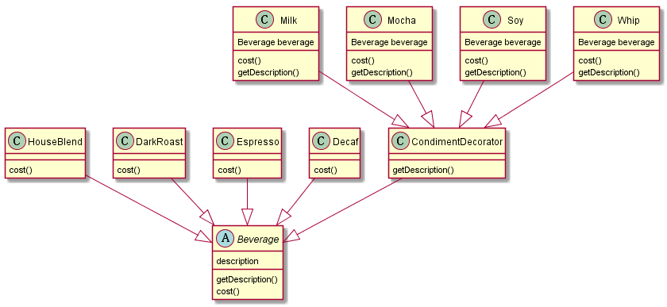

## 设计模式之一：装饰者模式

**定义**：动态地将责任附加到对象上。若要拓展功能，装饰者提供了比继承更有弹性的替代方案。


**主要解决**：一般的，我们为了扩展一个类经常使用继承方式实现，由于继承为类引入静态特征，并且随着扩展功能的增多，子类会很膨胀。

**何时使用**：在不想增加很多子类的情况下扩展类。

**如何解决**：将具体功能职责划分，同时继承装饰者模式。
<!-- more -->
**关键代码**： 
1. Component 类充当抽象角色，不应该具体实现。 
2. 修饰类引用和继承 Component 类，具体扩展类重写父类方法。

**应用实例**： 
1. 孙悟空有 72 变，当他变成"庙宇"后，他的根本还是一只猴子，但是他又有了庙宇的功能。 
2. 不论一幅画有没有画框都可以挂在墙上，但是通常都是有画框的，并且实际上是画框被挂在墙上。在挂在墙上之前，画可以被蒙上玻璃，装到框子里；这时画、玻璃和画框形成了一个物体。

**优点**：装饰类和被装饰类可以独立发展，不会相互耦合，装饰模式是继承的一个替代模式，装饰模式可以动态扩展一个实现类的功能。

**缺点**：多层装饰比较复杂。

**使用场景**： 
1. 扩展一个类的功能。 
2. 动态增加功能，动态撤销。

**注意事项**：可代替继承。

## 实例



### 代码

抽象类:
```java
// Beverage.class

public abstract class Beverage {
    String description = "Unknown bean.Beverage";

    public String getDescription() {
        return description;
    }

    public abstract double cost();
}

// CondimentDecorator.java

public abstract class CondimentDecorator extends Beverage{

    public abstract String getDescription();
}
```

具体组件：
```java
// DarkRoast.class

public class DarkRoast extends Beverage {
    @Override
    public double cost() {
        return 1.5;
    }

    public DarkRoast() {
        description = "darkRoast";
    }
}


// Decaf.java
public class Decaf extends Beverage {
    @Override
    public double cost() {
        return .67;
    }

    public Decaf() {
        description = "bean.Decaf";
    }
}

// Espresso.java
public class Espresso extends Beverage {
    @Override
    public double cost() {
        return 1.99;
    }

    public Espresso() {
        description = "Espresso";
    }
}

// HouseBlend.java
public class HouseBlend extends Beverage {
    @Override
    public double cost() {
        return .89;
    }

    public HouseBlend() {
        description = "House Blend Coffee";
    }
}

// Milk.java
public class Milk extends CondimentDecorator {
    Beverage beverage;

    public Milk(Beverage beverage) {
        this.beverage = beverage;
    }

    @Override
    public String getDescription() {
        return beverage.getDescription() + ", Milk";
    }

    @Override
    public double cost() {
        return 0.5 + beverage.cost();
    }
}

// Mocha.java
public class Mocha extends  CondimentDecorator {
    Beverage beverage;

    public Mocha(Beverage beverage) {
        this.beverage = beverage;
    }

    @Override
    public String getDescription() {
        return beverage.getDescription() + ", Mocha";
    }

    @Override
    public double cost() {
        return .20 + beverage.cost();
    }
}

// Soy.java
public class Soy extends CondimentDecorator {
    Beverage beverage;

    public Soy(Beverage beverage) {
        this.beverage = beverage;
    }

    @Override
    public String getDescription() {
        return beverage.getDescription() + ", Soy";
    }

    @Override
    public double cost() {
        return 0.7 + beverage.cost();
    }
}

// Whip.java
public class Whip extends CondimentDecorator {
    Beverage beverage;

    public Whip(Beverage beverage) {
        this.beverage = beverage;
    }

    @Override
    public String getDescription() {
        return beverage.getDescription() + ", Whip";
    }

    @Override
    public double cost() {
        return 0.8 + beverage.cost();
    }
}

```

```java

// StarbuzzCoffee.java
public class StarbuzzCoffee {
    public static void main(String[] args) {
        Beverage beverage = new Espresso();
        System.out.println(beverage.getDescription() + " $" + beverage.cost());

        Beverage beverage1 = new DarkRoast();
        beverage1 = new Mocha(beverage1);
        beverage1 = new Mocha(beverage1);
        beverage1 = new Whip(beverage1);
        System.out.println(beverage1.getDescription() + " $" + beverage1.cost());

        Beverage beverage2 = new HouseBlend();
        beverage2 = new Soy(beverage2);
        beverage2 = new Mocha(beverage2);
        beverage2 = new Whip(beverage2);
        System.out.println(beverage2.getDescription() + " $" + beverage2.cost());
    }
}

```