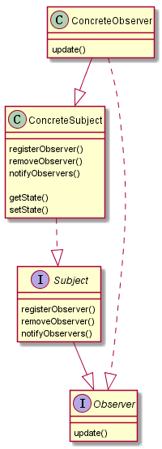
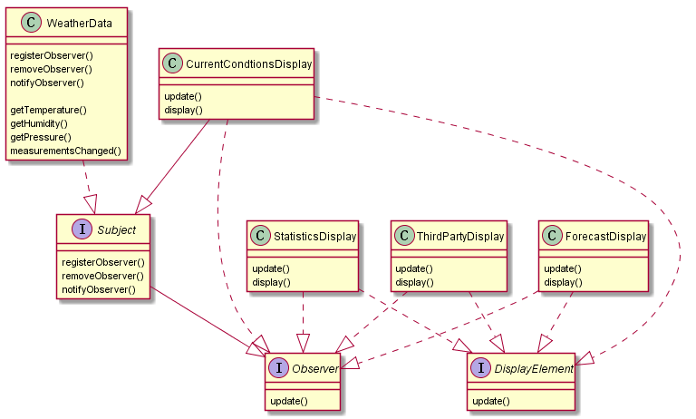

## 设计模式之一：观察者模式

**定义**：定义了对象之间的一对多依赖，这样一来，当一个对象改变状态时，它的所有依赖者都会收到通知并自动更新。

**主要解决**：一个对象状态改变给其他对象通知的问题，而且要考虑到易用和低耦合，保证高度的协作。

**何时使用**：一个对象（目标对象）的状态发生改变，所有的依赖对象（观察者对象）都将得到通知，进行广播通知。

**如何解决**：使用面向对象技术，可以将这种依赖关系弱化。

**关键代码**：在抽象类里有一个 ArrayList 存放观察者们。

<!-- more -->
**应用实例**： 
1. 拍卖的时候，拍卖师观察最高标价，然后通知给其他竞价者竞价。
2. 西游记里面悟空请求菩萨降服红孩儿，菩萨洒了一地水招来一个老乌龟，这个乌龟就是观察者，他观察菩萨洒水这个动作。

**优点**： 
1. 观察者和被观察者是抽象耦合的。 
2. 建立一套触发机制。

**缺点**： 
1. 如果一个被观察者对象有很多的直接和间接的观察者的话，将所有的观察者都通知到会花费很多时间。 
2. 如果在观察者和观察目标之间有循环依赖的话，观察目标会触发它们之间进行循环调用，可能导致系统崩溃。 
3. 观察者模式没有相应的机制让观察者知道所观察的目标对象是怎么发生变化的，而仅仅只是知道观察目标发生了变化。

**使用场景**：

一个抽象模型有两个方面，其中一个方面依赖于另一个方面。将这些方面封装在独立的对象中使它们可以各自独立地改变和复用。
一个对象的改变将导致其他一个或多个对象也发生改变，而不知道具体有多少对象将发生改变，可以降低对象之间的耦合度。
一个对象必须通知其他对象，而并不知道这些对象是谁。
需要在系统中创建一个触发链，A对象的行为将影响B对象，B对象的行为将影响C对象……，可以使用观察者模式创建一种链式触发机制。

**注意事项**： 
1. JAVA 中已经有了对观察者模式的支持类。 
2. 避免循环引用。 
3. 如果顺序执行，某一观察者错误会导致系统卡壳，一般采用异步方式。

## 定义类图




## 例子




### 不使用java Observable/Observer(java 9 之后废除)

```java
// DisplayElement.java

public interface DisplayElement {
    public void display();
}


// Observer.java
public interface Observer {
    public void update(double temp, double humidity, double pressure);
}


// Subject.java
public interface Subject {
    public void registerObserver(Observer o);
    public void removeObserver(Observer o);
    public void notifyObservers();
}

```


```java
// CurrentConditionsDisplay.java

public class CurrentConditionsDisplay implements Observer, DisplayElement {
    private double temperature;
    private double humidity;
    private Subject weatherData;

    public CurrentConditionsDisplay(Subject weatherData) {
        this.weatherData = weatherData;
        weatherData.registerObserver(this);
    }

    @Override
    public void display() {
        System.out.println("Current condition: " +  temperature + "F degrees and " + humidity + "% humidity");
    }

    @Override
    public void update(double temperature, double humidity, double pressure) {
        this.temperature = temperature;
        this.humidity = humidity;
        display();
    }
}


//WeatherData
import java.util.ArrayList;

public class WeatherData implements Subject {
    private ArrayList observers;
    private double temperature;
    private double humidity;
    private double pressure;

    public WeatherData() {
        observers = new ArrayList();
    }

    public void measurementsChanged() {
        notifyObservers();
    }

    public void setMeasurements(double temperature, double humidity, double pressure) {
        this.temperature = temperature;
        this.humidity = humidity;
        this.pressure = pressure;
        measurementsChanged();
    }

    @Override
    public void registerObserver(Observer o) {
        observers.add(o);
    }

    @Override
    public void removeObserver(Observer o) {
        int i = observers.indexOf(o);
        if(i >= 0) {
            observers.remove(i);
        }
    }

    @Override
    public void notifyObservers() {
        for(int i = 0; i < observers.size(); ++i) {
            Observer observer = (Observer)observers.get(i);
            observer.update(temperature, humidity, pressure);
        }
    }

    public double getTemperature() {
        return temperature;
    }

    public void setTemperature(double temperature) {
        this.temperature = temperature;
    }

    public double getHumidity() {
        return humidity;
    }

    public void setHumidity(double humidity) {
        this.humidity = humidity;
    }

    public double getPressure() {
        return pressure;
    }

    public void setPressure(double pressure) {
        this.pressure = pressure;
    }

}


// WeatherStation
public class WeatherStation {
    public static void main(String[] args) {
        WeatherData weatherData = new WeatherData();
        CurrentConditionsDisplay currentConditionsDisplay = new CurrentConditionsDisplay(weatherData);

        weatherData.setMeasurements(80, 65, 30.4f);
        weatherData.setMeasurements(82, 70, 29.2f);
        weatherData.setMeasurements(78, 90, 32f);
    }
}
```


### 使用java Observable/Observer
```java
// CurrentConditionsDisplay
import java.util.Observable;
import java.util.Observer;

public class CurrentConditionsDisplay implements Observer, DisplayElement {
    Observable observable;
    private double temperature;
    private double humidity;


    public CurrentConditionsDisplay(Observable o) {
        this.observable = o;
        observable.addObserver(this);
    }
    @Override
    public void update(Observable o, Object arg) {
        if(o instanceof WeatherData) {
            WeatherData weatherData = (WeatherData) o;
            this.temperature = weatherData.getTemperature();
            this.humidity = weatherData.getHumidity();
            display();
        }
    }

    public void display() {
        System.out.println("Current condition: " +  temperature + "F degrees and " + humidity + "% humidity");
    }
}


// WeatherData.java
import java.util.Observable;

public class WeatherData extends Observable {
    private double temperature;
    private double humidity;
    private double pressure;

    public WeatherData() {

    }

    public void setMeasurements(double temperature, double humidity, double pressure) {
        this.setChanged();
        notifyObservers(); // pull方法
        notifyObservers("Hello"); //push 方法
    }

    public double getTemperature() {
        return temperature;
    }

    public void setTemperature(double temperature) {
        this.temperature = temperature;
    }

    public double getHumidity() {
        return humidity;
    }

    public void setHumidity(double humidity) {
        this.humidity = humidity;
    }

    public double getPressure() {
        return pressure;
    }

    public void setPressure(double pressure) {
        this.pressure = pressure;
    }
}
```

```java
//WeatherStation.java
public class WeatherStation {
    public static void main(String[] args) {
        WeatherData weatherData = new WeatherData();
        CurrentConditionsDisplay currentConditionsDisplay = new CurrentConditionsDisplay(weatherData);

        weatherData.setMeasurements(80, 65, 30.4f);
        weatherData.setMeasurements(82, 70, 29.2f);
        weatherData.setMeasurements(78, 90, 32f);
    }
}
```