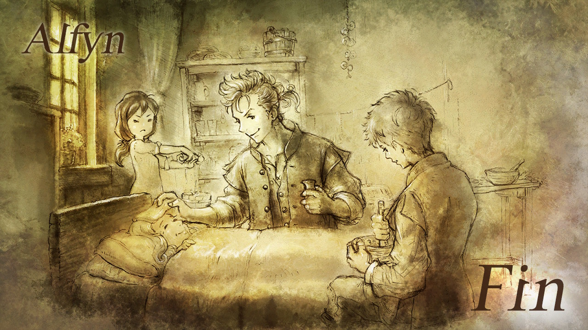
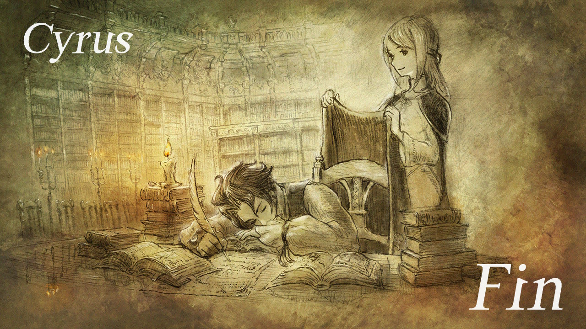
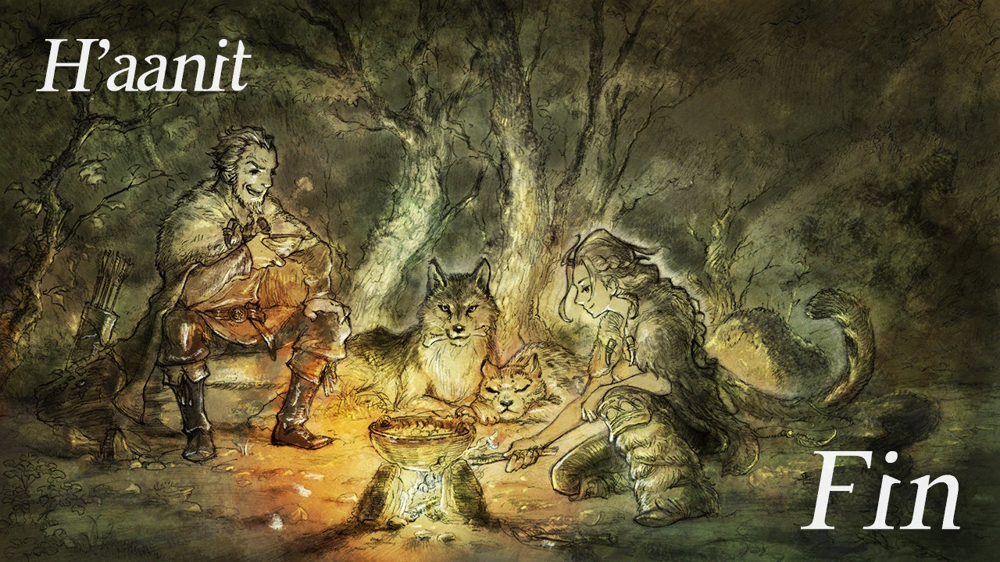
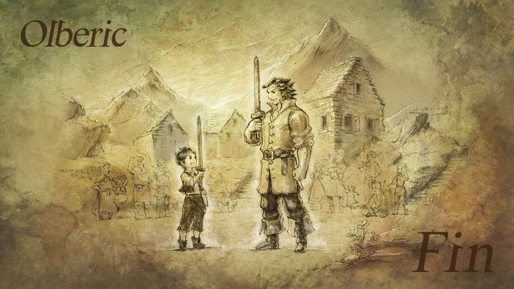
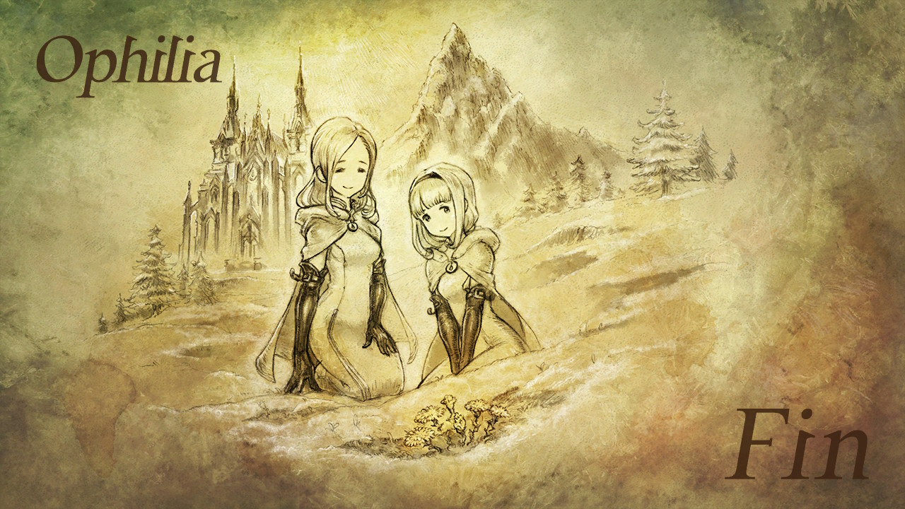
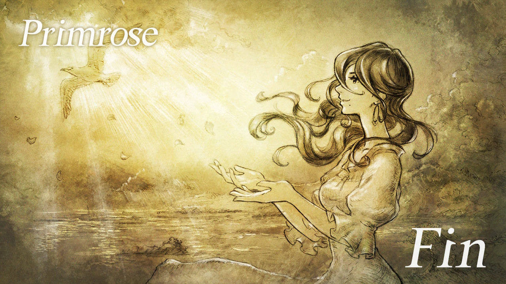
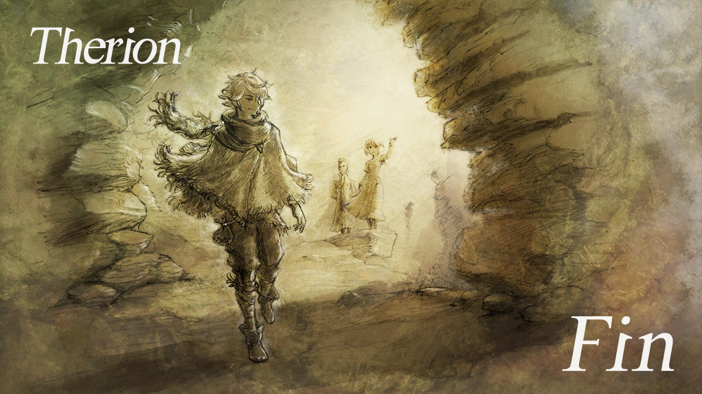
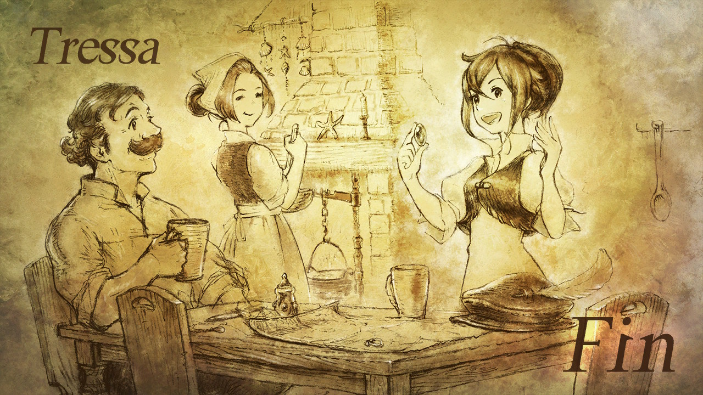
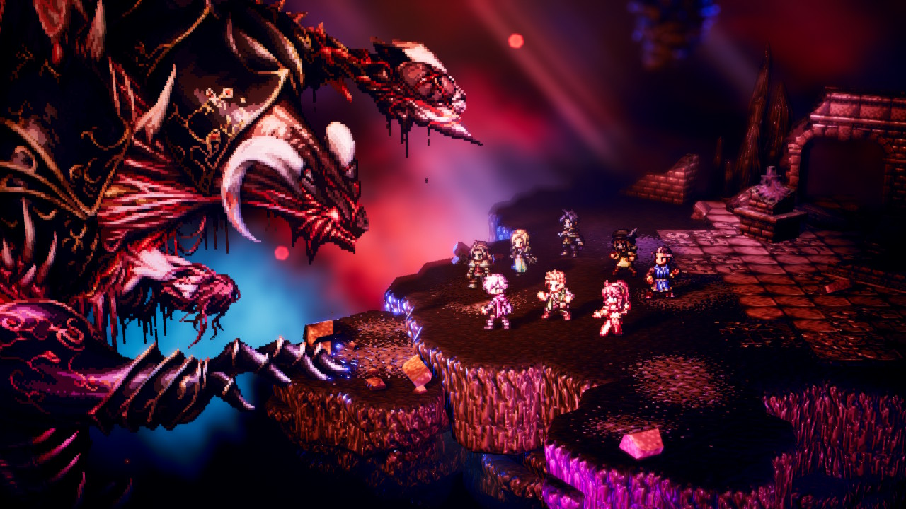

八方旅人，一方五十

第一次全通关一款JRPG，断断续续打了一个月，将近80小时全收集。

这个主线剧情最终Boss和隐藏Boss难度跨度有点大。

全角色第四章通关之后，花了5、6天准备升级和职业搭配准备打最后的隐藏Boss（PS：不愧是非酋之舞，不然也不会刷5天的级）

打完隐藏Boss之后整一个八方旅人的八个零散的主线就可以织起来了，总的剧情中规中矩。

游戏机制在老式传统回合制上有创新，玩起来有功有防，很有节奏感。同时音乐出色，不过价格偏贵，switch版玩完还可以回血。

推荐程度8/10

<!-- more -->

最后收藏了一些图：

