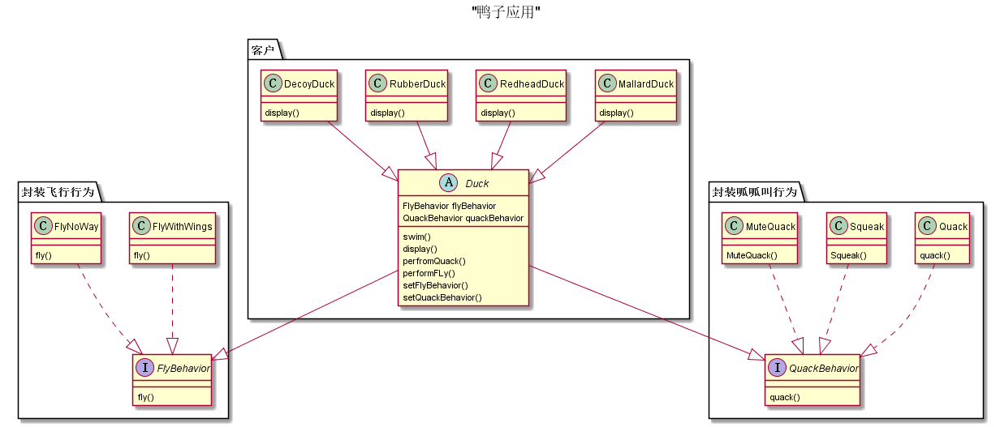

## 设计模式之一：策略模式
 
**定义**: 定义了算法族，分别封装起来，让它们之间可以相互替换，此模式让的变化独立于使用算法的客户。

**意图**：定义一系列的算法,把它们一个个封装起来, 并且使它们可相互替换。

**主要解决**：在有多种算法相似的情况下，使用 if...else 所带来的复杂和难以维护。

**何时使用**：一个系统有许多许多类，而区分它们的只是他们直接的行为。

**如何解决**：将这些算法封装成一个一个的类，任意地替换。

**关键代码**：实现同一个接口。
<!-- more -->
**应用实例**： 
1. 诸葛亮的锦囊妙计，每一个锦囊就是一个策略。 
2. 旅行的出游方式，选择骑自行车、坐汽车，每一种旅行方式都是一个策略。 
3. JAVA AWT 中的 LayoutManager。

**优点**： 
1. 算法可以自由切换。 
2. 避免使用多重条件判断。 
3. 扩展性良好。

**缺点**： 
1. 策略类会增多。 
2. 所有策略类都需要对外暴露。

**使用场景**： 
1. 如果在一个系统里面有许多类，它们之间的区别仅在于它们的行为，那么使用策略模式可以动态地让一个对象在许多行为中选择一种行为。 
2. 一个系统需要动态地在几种算法中选择一种。 
3. 如果一个对象有很多的行为，如果不用恰当的模式，这些行为就只好使用多重的条件选择语句来实现。

**注意事项**：如果一个系统的策略多于四个，就需要考虑使用混合模式，解决策略类膨胀的问题。


```java
// 针对实现编程
Dog d = new Dog();
d.bark();
```

```java
// 针对接口编程
Animal animal = new Dog();
animal.makeSound();
```


## 实例:




### 解释：

衍生的特定类具有Duck共同的属性和方法，所以不能设计成为接口，应该设置成为抽象类。
叫声和飞行行为，每种鸭子行为不同，可以设置为从一系列算法族中选取一个算法。


### 代码：

```java
// 算法接口
// FlyBehavior.java
public interface FlyBehavior {
    void fly();
}

// QuackBehavior.java
public interface QuackBehavior {
    void quack();
}

```

```java
// 鸭子对象
// Duck.java
public abstract class Duck {
    FlyBehavior flyBehavior;
    QuackBehavior quackBehavior;

    public Duck() {}

    public abstract void display();

    void performQuack() {
        quackBehavior.quack();
    }

    void performFly() {
        flyBehavior.fly();
    }

    public void swim() {
        System.out.println("I can swim");
    }

    public void setFlyBehavior(FlyBehavior flyBehavior) {
        this.flyBehavior = flyBehavior;
    }

    public void setQuackBehavior(QuackBehavior quackBehavior) {
        this.quackBehavior = quackBehavior;
    }
}


// MallardDuck.java
public class MallardDuck extends Duck {

    public MallardDuck() {
        flyBehavior = new FlyWithWings();
        quackBehavior = new Quack();
//        this.setFlyBehavior(new FlyWithWings());
//        this.setQuackBehavior(new Quack());
    }
    public void display() {
        System.out.println("I'm a real mallard duck");
    }

    public static void main(String[] args) {
        MallardDuck mallardDuck = new MallardDuck();
        mallardDuck.performFly();
        mallardDuck.performQuack();
        mallardDuck.display();

    }
}

// RedheadDuck.java
public class RedheadDuck extends Duck {
    @Override
    public void display() {

    }
}

// RubberDuck
public class RubberDuck extends Duck {
}
```


```java
// 算法实现，即鸭子的行为
// FlyNoWay.java
public class FlyNoWay implements FlyBehavior {

    @Override
    public void fly() {
        System.out.println("I cannot fly");
    }
}

// FlyWithWings.java
public class FlyWithWings implements FlyBehavior {
    @Override
    public void fly() {
        System.out.println("I can fly");
    }
}

// MuteQuack.java
public class MuteQuack implements QuackBehavior {
    @Override
    public void quack() {
        System.out.println("emmm");
    }
}

// Quack.java
public class Quack implements QuackBehavior {
    @Override
    public void quack() {
        System.out.println("Gua Gua");
    }
}


// Squeak.java
public class Squeak implements QuackBehavior {
    @Override
    public void quack() {
        System.out.println("Zhi Zhi");
    }
}

```

